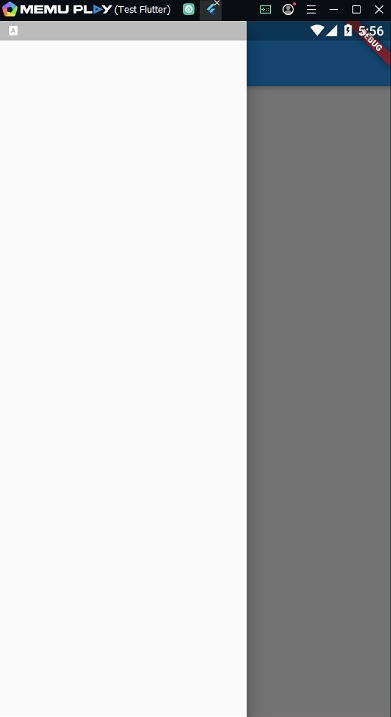
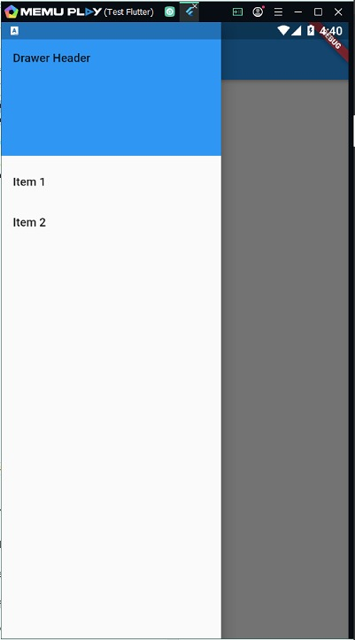
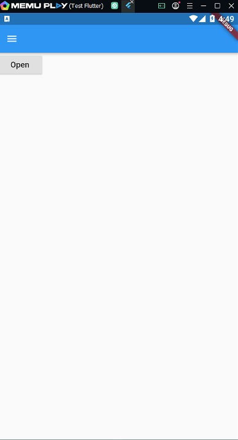
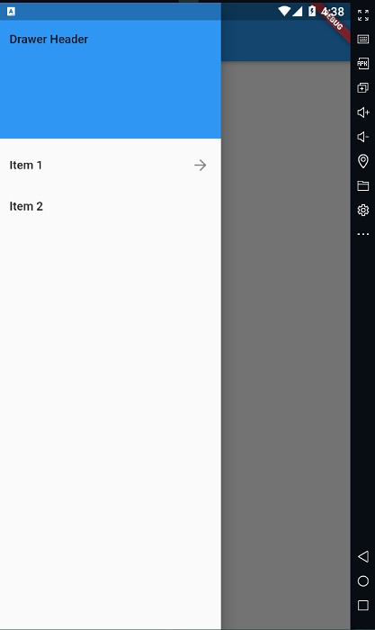
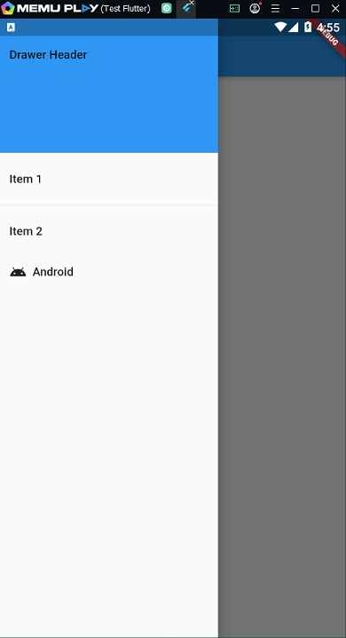
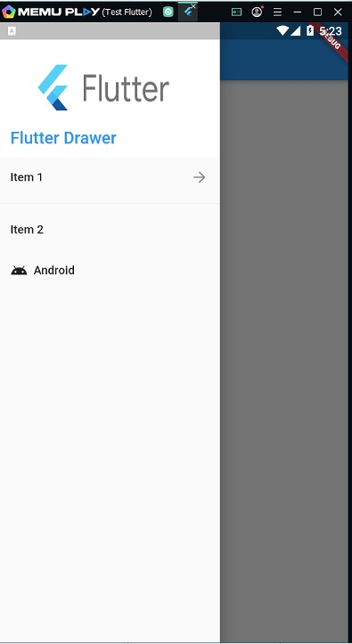

# TestDrawer

Proyecto simple de como implementar un Drawer(Menú lateral) en flutter.

## ¿Para qué sirve?

Al desarrollar una aplicación que tiene muchas pantallas para acceder a ellas por medio de pestañas, iconos o botones de la pantalla principal, es muy común utilizar un Drawer que se encarga de organizar de forma vertical ya sea en la parte izquierda o derecha de la pantalla, en la cual se puede acceder normalmente deslizando el contenido de la pantalla desde el borde del teléfono hacia el centro o simplemente tocando un botón de tipo hamburguesa.

## ¿En qué situaciones es adecuado su uso?
Yo recomiendo utilizar el Drawer si la aplicación tiene más de 5 módulos o pantallas, o si por motivos de espacio se requiere que utilizar toda la pantalla. En aplicaciones que usan Material Design, hay dos opciones principales para la navegación: tabs y drawers. Cuando no hay suficiente espacio para visualizar los tabs, los drawers proporcionan una alternativa práctica.

## ¿Que me parece interesante?

Personalmente elegí el widget porque es ampliamente utilizado como un elemento de navegación en las aplicaciones móviles. Adicional le genera orden a la aplicación, facilidad al usuario en la visualización simultanea del menú y la rápida navegación entre contenidos. Debido al gran uso que se le da a un dispositivo móvil, se ha incrementado la necesidad de tener una aplicaciones móviles cada vez más robustas por parte de personas, negocios y empresas …etc., donde es muy útil el uso de este widget

## Proyecto Paso a paso

Primero se debe crear la base del proyecto

```dart
flutter create TestDrawer
```

Este comando ya crea por defecto una base con la cual se puede comenzar a trabajar.

### Agregar Drawer al Scaffold

El Drawer debe inclúirse dentro del Scaffold que ya se creó automaticamente en el proyecto

```dart
Scaffold(
      appBar: AppBar(),
      drawer: Drawer()
)
```

Este creará automáticamente un ícono de menú en el lado izquierdo del AppBar

<div style="text-align:center">
    
</div>

Y un Drawer vacío al cual se puede acceder tocando el ícono o con el gesto de deslizar desde la esquina.

<div style="text-align:center">
    
</div>

Si se deseá tener el Drawer al lado derecho en vez de

```dart
      drawer: Drawer()
```

se tiene

```dart
      endDrawer: Drawer()
```

### Agregar contenido al Drawer

El Drawer se compone principalmente por un Header y una lista de Items para acceder a las páginas. Para agregar este contenido se utiliza un ListView para asegurar que el usuario pueda desplazarse por todos los items en caso de que no haya espacio suficiente verticalmente.

```dart
Drawer(
  child: ListView(
    // Se elimina cualquiet padding del ListView.
    padding: EdgeInsets.zero,
    children: <Widget>[
      DrawerHeader(
        child: Text('Drawer Header'),
        decoration: BoxDecoration(
          color: Colors.blue,
        ),
      ),
      ListTile(
        title: Text('Item 1'),
        onTap: () {

          // ...
        },
      ),
      ListTile(
        title: Text('Item 2'),
        onTap: () {

          // ...
        },
      ),
    ],
  ),
);
```

Con esto ya se tiene una estructura base para empezar a trabajar el Drawer

<div style="text-align:center">
    
</div>

### Abrir y cerar programaticamente el Drawer

Para abrir el drawer

```dart
    Scaffold.of(context).openDrawer();
```

He incluido un Botón el el Body que al tocarse abre el drawer, en caso de que se requiera incluir alguna lógica para esta finalidad

```dart
body: Builder(
    builder: (context) => RaisedButton(
        child: Text("Open"),
        onPressed: () {
            Scaffold.of(context).openDrawer();
        },
    ),
),
```

<div style="text-align:center">
    
</div>

Para cerrarlo

```dart
Navigator.pop(context);
```

```dart
        ListTile(
            title: Text('Item 2'),
            onTap: () {
            // ...
            Navigator.pop(context);
            },
        ),
```

### Agregar íconos a los items

Para agregar un ícono en forma de flecha en el lado derecho se agrega trailing al item

```dart
        ListTile(
            title: Text('Item 1'),
            trailing: Icon(Icons.arrow_forward),
            onTap: () {
            // ...
            },
        )
```

<div style="text-align:center">
    
</div>

Si se desea separar los items se hace por medio de un Divisor

```dart
    Divider(),
```

<div style="text-align:center">
    
</div>

Para agregar un ícono en la parte izquiera o hacer alguna modificación al estilo del texto se hace en el campo title

```dart
        ListTile(
            title: Row(
            children: <Widget>[
                Icon(Icons.android),
                Padding(
                padding: EdgeInsets.only(left: 8.0),
                child: Text("Android"),
                )
            ],
            ),
            onTap: () {},
        )
```

<div style="text-align:center">
    
</div>

### Modificar el Header

Algunas veces se requiere cambiar el estilo del header con el fin de agregar un logo llamativo o cambiar el texto para que la aplicación se vea mejor, todo esto es fácil hacerlo desde el DrawerHeader

```dart
            DrawerHeader(
                margin: EdgeInsets.zero,
                padding: EdgeInsets.zero,
                decoration: BoxDecoration(
                    image: DecorationImage(
                        fit: BoxFit.fill,
                        image: AssetImage("images/flutter_logo2.png"))),
                child: Stack(children: <Widget>[
                  Positioned(
                      bottom: 12.0,
                      left: 16.0,
                      child: Text("Flutter Drawer",
                          style: TextStyle(
                              color: Colors.blue,
                              fontSize: 20.0,
                              fontWeight: FontWeight.w500))),
                ])
            )
```

<div style="text-align:center">
    
</div>
